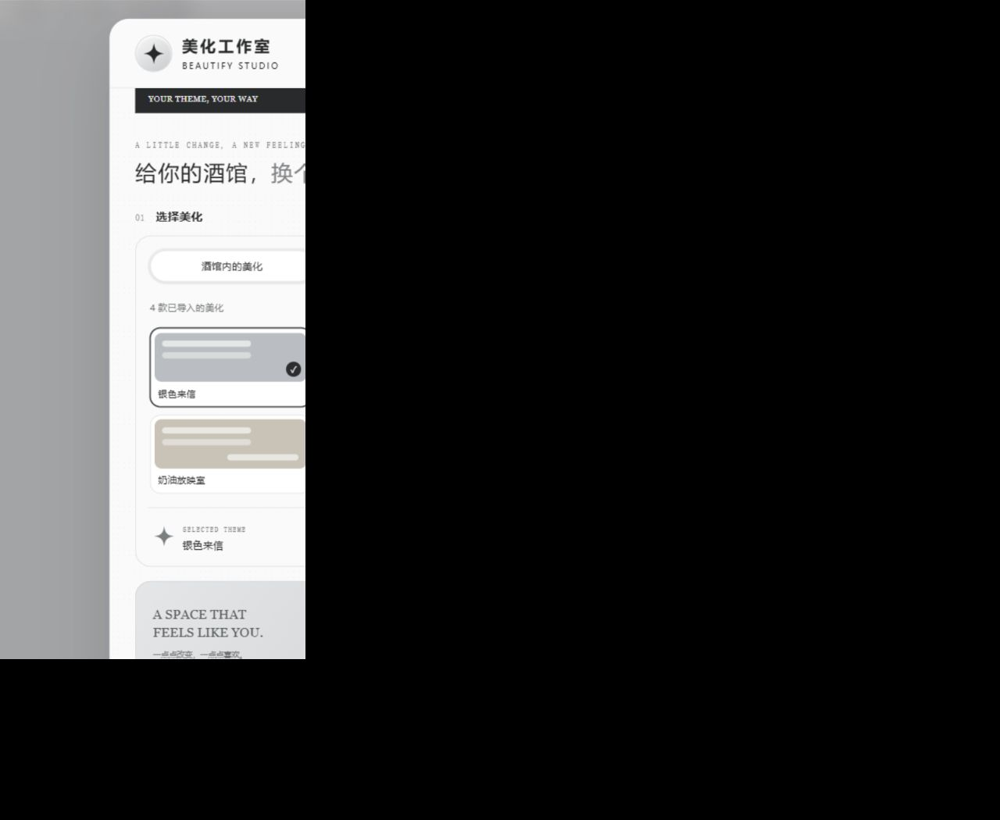

# ✦ 美化工作室

**在 SillyTavern / TauriTavern 中调整美化、预览效果，保存到原美化或生成适配副本。**

银灰色 INS 风格工作台，支持直接选择酒馆内已导入的美化，也支持上传 JSON。现在是标准 SillyTavern 扩展，可从“扩展安装”直接输入 GitHub 地址。基于用户提供的「TT 美化适配 v0.2.14」重构。



[手机界面预览](docs/preview-mobile.png)

## 安装与升级

1. 在 SillyTavern 的**扩展 → 安装扩展**中粘贴：`https://github.com/yui-ovo/beautify-studio`。
2. 安装完成后启用 **美化工作室**，刷新页面。
3. 从扩展面板或魔法棒菜单打开 **美化工作室**。
4. 旧的「TT 美化适配」全局脚本要停用，避免两个版本同时注册入口。

仓库根目录包含 `manifest.json`、`index.js` 和 `style.css`，是标准扩展结构。旧版酒馆助手用户仍可下载 [`dist/美化工作室.json`](dist/美化工作室.json) 作为全局脚本导入。

## 使用

### 可视化微调（v1.6.0 体验功能）

底部「美化适配 / 可视化微调」切换两个独立页面。切回适配页时临时恢复原美化，微调草稿、撤销记录和搜索保留；回来继续预览。若原美化在此期间被切换或修改，会结束旧草稿，避免覆盖新美化。

「作者说明」搜索覆盖当前草稿的整份 CSS：注释、选择器、属性、数值和 URL 都可搜索，无注释代码也不会遗漏。命中结果直接显示附近代码、行号和高亮；清空搜索恢复作者说明列表。

- 输入栏上下位置只移动输入框与其中按钮；底部背景高度单独调整背景绘制，不改安全区或挤动输入框。
- 只有确认作者字号实际生效、且不跟随酒馆字体比例的正文，才显示字号加减；正常跟随比例或无法确定的规则不开放。字号修改限定于聊天正文。
- 输入框提示文字支持作者 CSS 叠字和原生提示语。作者叠字保留原本的显示条件，原生提示语不修改消息草稿。
- 原生提示语和独立背景绘制需保持工作室启用；设置保存在当前美化 CSS，导出 JSON 会一起带走。切换主题或关闭未保存预览时会恢复。
- 底部背景目前识别标准外层背景；透明外层、作者另外绘制的背景不会强行覆盖，面板会提示未识别。真实 ST/TT 手机 WebView 仍需回归。

「图片资源」位于作者说明与修改记录之间，显示 CSS `url(...)` 的真实缩略图和附近注释。可粘贴新链接，或从相册选图自动内嵌；替换与头像微调共用撤销、重做和保存当前美化。

静态相册图片最长边缩到 1600px，优先编码为 WebP；GIF 在 2 MB 内保留动画。文件不上传图床，导出 JSON 时图片一起带走，文件体积会增加。外链失效或被防盗链限制时会显示缩略图不可用，仍可替换。第一版读取声明内的 `url(...)`，不处理 `@import`、字体、纯渐变、仅含字符串的 `image-set()` 或聊天消息图片。

先在酒馆应用一款已保存的 UI 美化并打开聊天，再进入 **美化工作室 → 可视化微调**。当前版本支持角色头像和用户头像的大小、圆角、边框与位置，以及底部输入栏的上下位置和底部背景高度；可直接点选头像，收起面板后用浮动手柄调整，支持 1px / 5px 步长、长按和撤销/重做。

「作者说明」展示当前 CSS 中保留的注释，可搜索并查看附近代码。调整只写入临时预览；关闭时恢复，保存时通过酒馆原生更新按钮写入当前美化，名称不变，也可以导出 JSON。编辑的是当前激活的美化，主面板选中的其他美化不会自动用于微调。

这是第一版体验功能：顶栏、输入框其他外观与气泡编辑尚未开放，复杂非像素位移暂不支持；已通过自动测试与模拟宿主的桌面/手机视口验证，真实 ST/TT 与手机 WebView 仍待回归。详见 [可视化微调说明](docs/VISUAL-EDITOR.md)。

### 美化库与 TT 适配

- **酒馆内的美化**：读取已经保存的 UI 美化列表，点击一款即可分析。读取、选择不会切换当前美化。色块是主题配色示意，不是真实主题截图。
- **上传 JSON**：选择或拖入 UI 美化 JSON（最大 10 MB）。支持只有颜色设置、没有自定义 CSS 的主题。
- **调整适配**：隐藏快速扮演按钮、保持隐藏按钮状态、修复布局冲突。
- **段落首行缩进**：开启后把 `#chat p { text-indent: 2em; }` 写入适配副本，只作用于聊天区域。
- **直接注入原美化**：将适配结果写入列表中选中的一款已安装美化，自动切换到该美化后保存，名称不变；上传的 JSON 请使用生成副本。
- **批量删除**：删除按钮作用于当前列表；未搜索时是全部美化，搜索后只删除匹配项。确认后调用酒馆原生删除接口并核对结果，删除不可恢复。
- **生成副本并应用**：通过酒馆原生导入与切换流程创建副本。重名时添加数字后缀，不覆盖原主题。随后核对保存的副本 CSS。
- **仅下载适配版**：下载转换后的 UI 主题 JSON，用于手动导入。它与安装工作室的“脚本 JSON”不同。
- **布局诊断**：导出视口、元素几何和冲突统计，便于排查手机键盘、刘海区和抽屉问题。

原“隐藏 TT Agent 原子按钮”选项与强制隐藏逻辑已删除。Agent 被酒馆本身设为隐藏时，“保持隐藏按钮的状态”仍尊重原状态。

导入含 `@import` 的主题时，工作室会暂时收起，让酒馆自身的确认窗口可操作；最长等待两分钟。主题适配副本保存通过后才提示核实成功。聊天/角色绑定主题的后续切换遵循 TauriTavern 原有规则。

## 本地开发

需要 Node.js 22 或更高版本。

```sh
npm ci
npm run dev
```

打开 `http://127.0.0.1:4173`。此页面加载与发行版相同的脚本，使用 `preview/mock-host.js` 模拟酒馆接口。示例数据和模拟保存仅存在于当前预览页，**不会打包进发行脚本**，不代表已经连接真实酒馆。

```sh
npm test       # 核心转换、校验、宿主读取与保存验证
npm run build # 生成 JS 与可导入的酒馆助手 JSON
npm run check # 测试 + 构建
```

预览构建自动监听源码；编辑后刷新页面。构建无运行时 CDN、外部字体或图片依赖。

## 项目结构

```text
src/
  config.js           版本、选项、兼容标记
  core/adapter.js     CSS 分析与主题转换，不依赖 DOM
  core/validation.js  UI 主题结构校验
  host/themes.js     酒馆内美化读取、保存验证
  host/diagnostics.js 布局诊断
  ui/markup.js       工作台结构
  ui/studio.css      设计变量、桌面与手机样式
  main.js            酒馆助手入口、交互与生命周期
preview/             独立开发预览与模拟宿主
tests/               Node.js 自动测试
scripts/             构建、预览服务与发布打包
dist/                可直接使用的发行文件
docs/                架构、验证说明与发布步骤
```

## 兼容边界

- 面向安装了酒馆助手的 SillyTavern / TauriTavern。普通 SillyTavern 中可以生成面向 TT 的副本。
- 美化列表使用宿主的 `/api/settings/get`，原生导入依赖 `#themes`、`#ui_preset_import_file` 和 `#custom-style`。宿主改变接口后可能需要适配；相关代码集中在 `host` 与 `main.js`。
- CSS 检查是保守的启发式规则，不是完整 CSS 解析器。复杂嵌套、混合选择器与第三方扩展布局可能需手动检查；风险清单不是“全部兼容”的承诺。
- 面板位于 Shadow DOM，避免外部美化污染界面；不会在面板内执行所选主题的任意 CSS。
- 已有自动测试与模拟宿主浏览器验证；尚未完成真实设备上的 TauriTavern/iOS/Android 导入、键盘、角色绑定回归。详见 [验证记录](docs/VALIDATION.md)。

## 公开发布到 GitHub

项目仓库：[yui-ovo/beautify-studio](https://github.com/yui-ovo/beautify-studio)。

源码、可导入脚本和预览图随仓库提供。维护流程见 [发布说明](docs/RELEASING.md)；打 `v*` 标签可自动创建包含脚本 JSON 的 Release。

## 来源与授权

原脚本来自用户提供的 `TT美化适配v0.2.14.json`，附件未附带许可证或作者授权信息。因此本项目没有擅自替原代码指定 MIT 等开源许可证。**公开分发前，请由维护者确认原脚本分发权限并补充 LICENSE 与署名**。代码结构和发布流程已准备完成，授权状态单独记录在 [NOTICE](NOTICE.md)。

视觉参考为用户提供的银灰 INS 拼贴图；仅提炼配色、布局与形状，没有复制参考截图或使用其中的商业素材。设计方法参考 [VoltAgent/awesome-design-md](https://github.com/VoltAgent/awesome-design-md)，项目自己的规则见 [DESIGN.md](DESIGN.md)。
